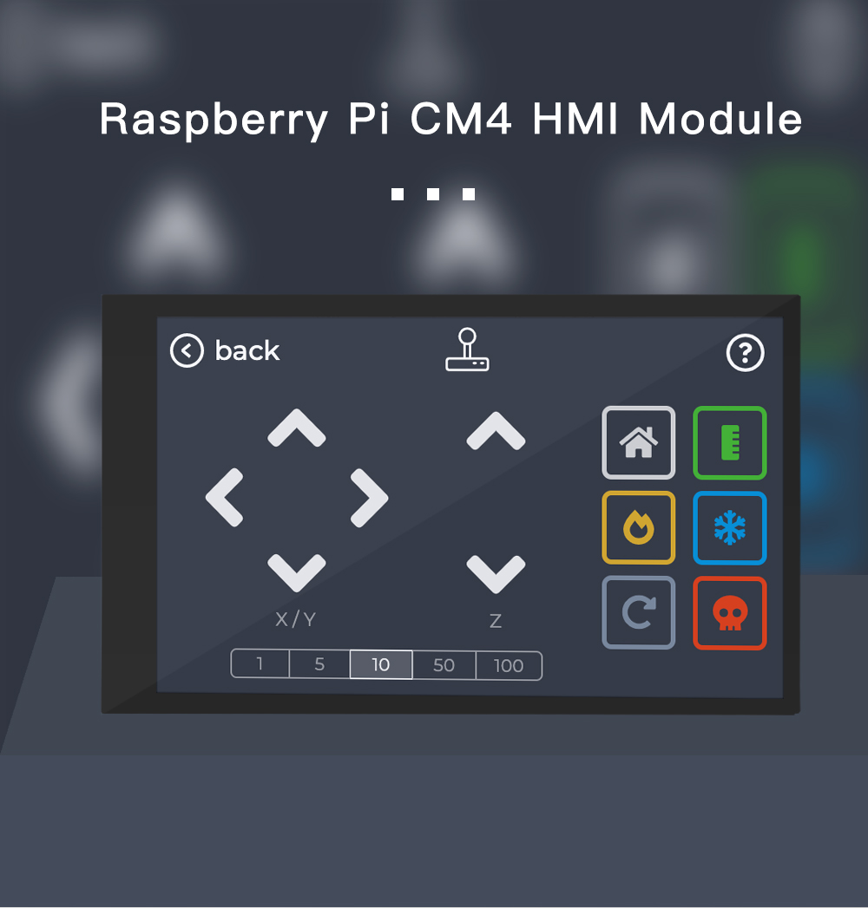
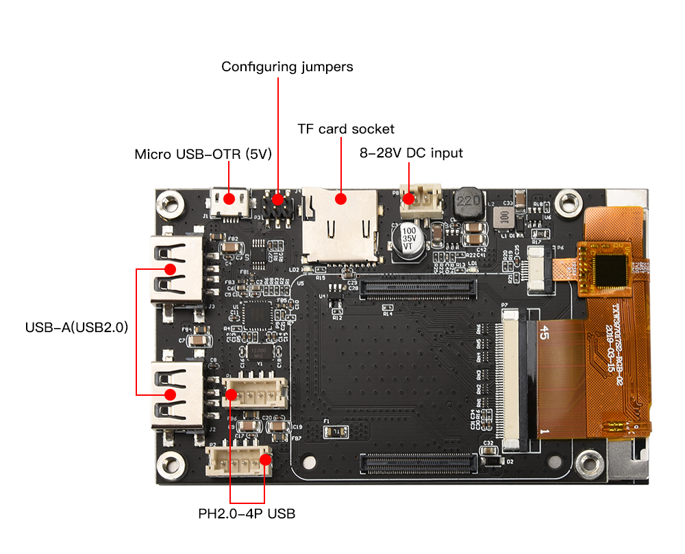
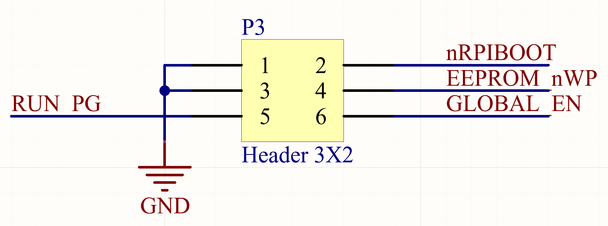
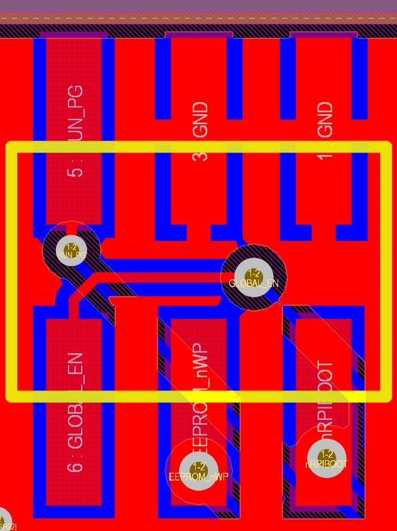

# FYSETC-CM4_HMI_MODULE

## 1 Introduction

This is a solution that integrates the capacitive touch screen and the Raspberry Pi computing module. In the only 56x97 size, it integrates 4 flexible USB (2 on the side and 2 on the board), 5V@3A DC power supply circuit. It is especially suitable for HMI applications on devices with compact space, such as 3D printers, small CNCs, etc. You can run HMI project like octodash, octoscreen and KlipperScreen 

| **Specification**  | **Details**                                                  |
| ------------------ | ------------------------------------------------------------ |
| Display            | 800*480  IPS Screen via DPI interface (18bit)                |
| Touch              | 5-Point  Multi-point Capacitive Touch                        |
| Network            | CM4  Onbard WIFi or use a USB WiFi adapter on USB2.0.        |
| USB                | 2x  USB-A Socket  2x  PH2.0-4P Connector                     |
| Storage            | Micro-SD  Card Slot (load system Image for non-eMMC CM4 version) |
| Power              | 8V-28V  DC Input                                             |
| Temperature  Range | 0°C  to +85°C                                                |
| Dimensions         | 56x97mm                                                      |
| Weight             | 43g                                                          |

## 2. Hardware

### 2.1 Configuring jumpers

Below pins are `RUN_PG`,`GLOBAL_EN`,`EEPROM_nWP`,`nRPIBOOT`. You need to set the jumpers according to your CM4.

| SCH                      | PCB                  |
| ------------------------ | -------------------- |
|  |  |

## 3. Software

You need to install the screen driver first, the screen we used is CTP40, please follow the instruction [here](https://github.com/FYSETC/FYSETC-CTP40) to install the driver.

